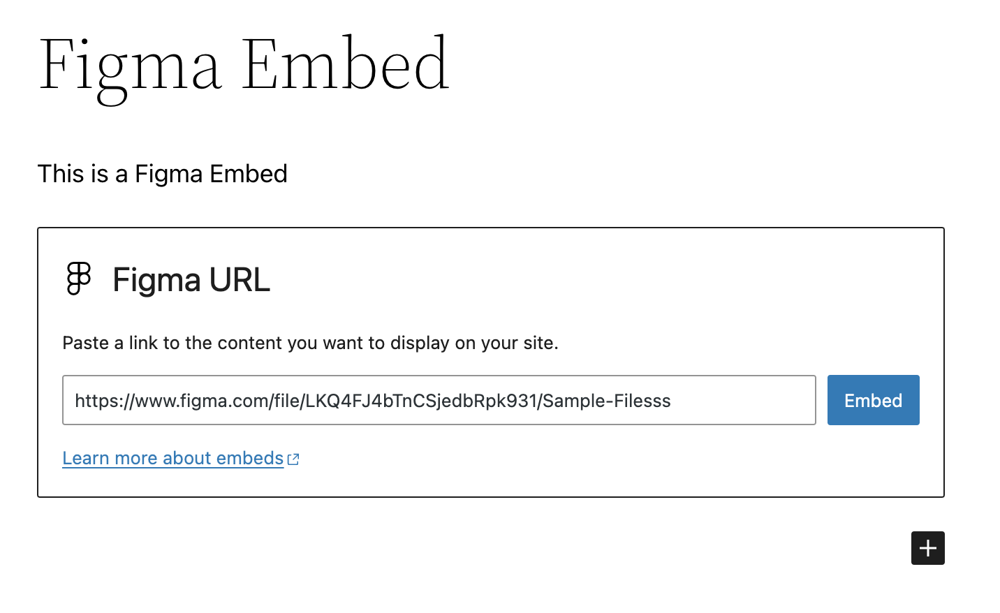

# Embed Block for Figma

         

> A Figma Block for the WordPress block editor (Gutenberg).

## Features

* Embed a Figma file using a block in the WordPress editor.
* Paste a Figma URL on a new line in the Block Editor to automatically convert it to a Figma Embed block.
* Block settings allow for altering margins of rendered Figma file embed

## Requirements

* PHP 7.4+
* [WordPress](http://wordpress.org) 6.5+

## Installation

* You can install the plugin manually by [downloading a zip file](https://github.com/10up/embed-block-figma/releases/latest) from GitHub.
* You then need to upload the zip file to your WordPress site by going to *WP-Admin > Plugins > Add New > Upload Plugin* and selecting the zip file from your computer.

## Getting Started

Once the plugin is installed and activated, you should see a new Figma Embed block. Insert this block into your content and enter the URL of the Figma file you want to embed.

Assuming it's a valid URL, the block will automatically fetch the Figma file and display it in the editor. Once saved, this will also display on the front-end.

## Support Level

**Beta:** This project is quite new and we're not sure what our ongoing support level for this will be. Bug reports, feature requests, questions, and pull requests are welcome. If you like this project please let us know, but be cautious using this in a Production environment!

## Changelog

A complete listing of all notable changes to Embed Block for Figma are documented in [CHANGELOG.md](CHANGELOG.md).

## Contributing

Please read [CODE_OF_CONDUCT.md](CODE_OF_CONDUCT.md) for details on our code of conduct, [CONTRIBUTING.md](CONTRIBUTING.md) for details on the process for submitting pull requests to us, and [CREDITS.md](CREDITS.md) for a listing of maintainers, contributors, and libraries for Embed Block for Figma.

## Like what you see?

